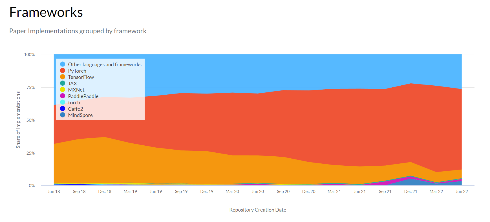

# Artificial-Intelligence-Roadmap

## 一、项目初衷

该repo旨在给 [极创工作室](https://geek-tech.club) 和 西电科创社 的学弟学妹提供一个大致的人工智能学习路径图，该路径图仅供参考，具体实施需要结合自己的实际情况就行选择。我们欢迎更多的同学对该repo有更多建议和优化方案，欢迎您使用`Forking`工作流提交 Pull Request，具体参考[atlassian文档](https://www.atlassian.com/git/tutorials/comparing-workflows/forking-workflow)，大致步骤如下：

1. 在GitHub上Fork本仓库
2. Clone Fork后的个人仓库
3. 设置`upstream`仓库地址，并禁用`push`
4. 我们建议使用分支开发
5. PR之前保持与原始仓库的同步，之后发起PR请求

## 二、学习路线及必备技能

### 2.1 学习路线

学习路线的制定主要参考了以下资料及链接：

1. 西安电子科技大学人工智能专业2020级本科生培养方案
2. Datawhale人工智能培养方案
3. https://tjxj.github.io/

> 想了好久，以下的学习路线仅是自己的学习路线的补充

我推荐的学习路线是：练习代码 -> 学好数学 -> 学习理论 -> 大量实践

1. 练习代码

   我将代码放在第一位，是因为你即使有很多很好的思路，但是不能实现，都等于空谈。因此在大一的计算机导论、python和数据结构学习中，希望各位能够多刷题，毕竟代码这个事情真的是：无他，唯手熟尔。重视每一层写代码的实验，不要图方便，全程cv。除此之外，还需要自己去学习Pytorch等主流框架。

2. 学好数学

   我觉得学习机器学习或者深度学习理论之前，还是有一定的数学基础是最好的。比如你想了解深度学习最核心的BP反向传播，那你起码需要学完高数上的求导；你想知道张量的矩阵运算，起码应该学习线性代数；你想学习贝叶斯网络，那么起码学完概率论吧... ...总的来说，我希望各位还是能从道的角度去学习，而不是术的层面去使用，一步一个脚印。

3. 学习理论

   理论层面的话，我觉得可以去看下下面推荐的课程和多看一些比较经典的书籍。

4. 大量实践

   **无他，唯手熟尔**

### 2.2 必备技能

- 前置技能

  1. Git

     Git是目前世界上最先进的分布式版本控制系统（个人意见，不喜勿喷）。版本控制系统就是可以使我们的代码回溯到特定的阶段（避免疯狂ctrl z，没错说的就是屏幕前面不会有版本控制软件的你）。至于这些名词，我觉得大家去查一下就知道了。学习资料的话，推荐下面几个资料，希望能够帮助大家：

     1. 廖雪峰Git教程 -> [url](https://www.liaoxuefeng.com/wiki/896043488029600/896067008724000)
     2. Git pro -> [url](https://www.progit.cn/)
     3. Git官网
     4. faster-git -> [url](https://github.com/datawhalechina/faster-git) (好吧，这个也是我不要脸，打广告/doge，动动小手点个star)

  2. **Github**

     Github我觉得是必须要掌握的技能之一，在Github上你不仅可以学习（~~copy~~)代码的规范书写，还可以学习到一些奇奇怪怪的技能（比如：how to cook）。但是，希望对Github上的内容进行辨别，做一个爱党爱国的好青年，而不是散发奇怪言论。

  3. **搜索引擎**

     问问题之前，先使用搜索引擎... ...

     

  4. markdown

     在Github上的项目里，我们会发现很多以.md结尾的文件，主要记录的是一些文档资料。而这些文件就是用markdown写的文件。markdown是程序员必备的写文档技能，相较于word而言，可以带来更高的打字享受，学习周期短（大概30min）。

  5. python

     许多机器学习和深度学习框架都是基于Python开发，因此python的学习至关重要。（个人认为，学到面向对象就行了）python的学习我只推荐两个资料，一个是下方三中的01 **Python编程：从入门到实践 - 第二版**和**廖雪峰老师写的python教程** -> [url](https://www.liaoxuefeng.com/wiki/1016959663602400)。除去基本的学习以外，深度学习和机器学习涉及到大量的张量操作和图片读取操作，我个人建议大家可以再学习下下方的三个库。

     1. Numpy
     2. Pandas
     3. 数据读取：Opencv和PIL

- 数学知识

  不论是机器学习还是深度学习，其实质是一个数学优化问题。因此，人工智能与数学紧密相关（当然，你不懂数学但是也可以会用），我希望各位能从道的角度去学习人工智能，而不是从术的角度只是去调用现有成熟的API。我们在下面列出和人工智能关系比较密切的数学。

  1. 高等数学（上\下）

     高等数学是最基础的一门学科，机器学习与深度学习与数学关系密切，因此建议大家好好学习高等数学（不要轻视）

  2. 线性代数

     线性代数同样是基础的一门学科，因为机器学习和深度学习涉及大量的矩阵操作知识，说实话，没学懂也不影响你用。但是我希望大家能从道的角度去学习，而不是局限于术的层次学习使用。

  3. 概率论与数理统计

     同样是一门极其重要的课程，在大三上的机器学习，模式识别中占据及其重要的地位。

  4. 最优化方法

     深度学习和机器学习实际上都是根据数据去优化模型，因此优化方法十分重要。这门课在西安电子科技大学20级人工智能专业是在大二下开设，个人觉得学起来倒也不是很难，是挺有趣的一门学科。

- 框架运用

  1. 框架简介

     为了优化大家的开发体验，Google，Meta，Amazon，百度等机构推出了许多深度学习和机器学习框架，下图来源于paper with code -> [url](https://paperswithcode.com/trends)。我们可以看见整体上Pytorch已经从老大哥Tensorflow上接过了接力棒，因此我们还是建议大家学习PyTorch。

     

  2. PyTorch

     **允许我在这先打个广告：我们为了帮助大家更好的学习PyTorch，我们开设了[thorough-pytorch](https://github.com/datawhalechina/thorough-pytorch)课程，如果大家觉得有帮助的话，欢迎大家动一动小手点个star。**	

  3. Tensorflow2.x

  4. Keras
  
  5. Paddlepaddle
  
  6. JAX
  
  7. MXNet

## 二、课程资料

| 课程序号 | 课程名字                                     | 总时长   | 链接地址                                                     |
| -------- | -------------------------------------------- | -------- | ------------------------------------------------------------ |
| 01       | 计算机视觉（本科）北京邮电大学 - 鲁鹏        | 21:29:39 | [[video url](https://www.bilibili.com/video/BV1nz4y197Qv?spm_id_from=333.337.search-card.all.click&vd_source=206566e58b9a1dbba8404cfac33ee816)] |
| 02       | 计算机视觉与深度学习 北京邮电大学 - 鲁鹏     | 23:25:04 | [[video url](https://www.bilibili.com/video/BV1V54y1B7K3?spm_id_from=333.337.search-card.all.click&vd_source=206566e58b9a1dbba8404cfac33ee816)] |
| 03       | 【吃瓜教程】《机器学习公式详解》 - Datawhale | 15:14:29 | [[video url](https://www.bilibili.com/video/BV1Mh411e7VU?spm_id_from=333.337.search-card.all.click)] |
| 04       | Transformer模型 - ShusenWang                 | 约1h     | [[video url](https://space.bilibili.com/1369507485/favlist?fid=1242263885&ftype=create)] |
| 05       | 2021版深度学习课程Deeplearning.ai - 吴恩达   | 28:35:55 | [[video url](http://xn--2021Deeplearning-lx0zk18e7h5aounuwinv1f93uays6be17f9mua.ai)] |
| 06       | DeepLearning.ai 四项基础课                   |          | [[docs](http://DeepLearning.ai)]                             |
| 07       | 适用于初学者的Pytorch编程教学                | 10:07:24 | [[video url](https://www.bilibili.com/video/BV15K411N7CF?spm_id_from=333.337.search-card.all.click&vd_source=206566e58b9a1dbba8404cfac33ee816)] |
| 08       | 2022最新版-机器学习深度学习课程 - 李宏毅     | 41:48:53 | [[video url](https://www.bilibili.com/video/BV1m3411p7wD?spm_id_from=333.337.search-card.all.click&vd_source=206566e58b9a1dbba8404cfac33ee816)] |
| 09       | CS229(2018秋）机器学习                       | 26:33:14 | [[video url](https://www.bilibili.com/video/BV1Et4y1U7WB?spm_id_from=333.337.search-card.all.click&vd_source=206566e58b9a1dbba8404cfac33ee816)] |
| 10       | CS231n(2022 slides) 计算机视觉 - 李飞飞      |          | [[slides url](http://cs231n.stanford.edu/slides/2022/)]      |
| 11       | CS224（2021）自然语言处理                    | 25:15:27 | [[video url](https://www.bilibili.com/video/BV18Y411p79k?spm_id_from=333.337.search-card.all.click)] |
| 12       | 动手学深度学习 PyTorch版 - 李沐              | 约48h    | [[video url](https://space.bilibili.com/1567748478)]         |
| 13       | Practical Deep Learning for Coders           |          | [[docs](https://course.fast.ai/)]                            |
| 14       | 精读论文系列 - 李沐                          |          | [[video url](https://space.bilibili.com/1567748478/channel/collectiondetail?sid=32744)] |
| 15       | CS329P - 李沐                                | 11:16:00 | [[video url](https://space.bilibili.com/1567748478/channel/collectiondetail?sid=28144)] |
| 16       | 机器学习基石 - 林轩田                        | 15:22:06 | [[video url](https://www.bilibili.com/video/BV1Cx411i7op?spm_id_from=333.337.search-card.all.click&vd_source=206566e58b9a1dbba8404cfac33ee816)] |
| 17       | 机器学习技法 - 林轩田                        | 16:03:43 | [[video url](https://www.bilibili.com/video/BV1ut41197F6?spm_id_from=333.337.search-card.all.click)] |
| 18       | 最优化理论与方法                             | 约23h    | [[video url](https://space.bilibili.com/507629580?spm_id_from=333.337.search-card.all.click)] |
| 19       | 机器学习白板推导                             | 60:39:02 | [[video url](https://www.bilibili.com/video/BV1aE411o7qd?spm_id_from=333.337.search-card.all.click&vd_source=206566e58b9a1dbba8404cfac33ee816)] |
| 20       | 机器学习2021 - 吴恩达                        | 19:37:02 | [[video url](https://www.bilibili.com/video/BV1Pa411X76s?spm_id_from=333.337.search-card.all.click&vd_source=206566e58b9a1dbba8404cfac33ee816)] |
| 21       | 深度学习2021 - NYU-LeCun                     | 41:37:48 | [[video url](https://www.bilibili.com/video/BV1kq4y137XV?spm_id_from=333.337.search-card.all.click&vd_source=206566e58b9a1dbba8404cfac33ee816)] [[docs](https://atcold.github.io/pytorch-Deep-Learning/zh/)] |

## 三、书籍资料

> 我学习的路子比较野，并看不下去太厚的书，但是我不排除学弟学妹之中有爱看书的孩子，我们在这也推荐几本不错的书。

| 编号 | 书籍名称                          | 出版社          |
| ---- | --------------------------------- | --------------- |
| 01   | Python编程：从入门到实践 - 第二版  | 人邮&工信出版社 |
| 02   | 机器学习的数学 - 雷明             | 人邮&工信出版社 |
| 03   | 机器学习公式详解 - 谢文睿、秦州    | 异步图书        |
| 04   | 机器学习 - 周志华                 | 异步图书       |
| 05   | 统计学习方法 - 李航               | 清华大学出版社  |
| 06   | 动手学深度学习 - 李沐             | 人民邮电出版社  |
| 07   | 深度学习 - （花书）               | 人民邮电出版社  |
| 08   | 神经网络与深度学习 - 邱锡鹏        | 机械工业出版社  |
| 09   | 深度学习推荐系统 - 王喆           | 电子工业出版社  |
| 10   | 信息检索导论 - 王斌（译）          | 人民邮电出版社  |
| 11   |                                  |               |

## 三、Paper推荐(经典之作)

> 教给大家一个搜索的方式：-> Github -> Awesome-想搜索的方向（eg: Awesome-object-detection

### 读论文

工欲善其事，必先利其器。我觉得每个人找到一个适合自己读论文的方式就ok，在这里，我先分享下我一般读论文的workflow和工具。

- Readpaper

​		Readpaper是由IDEA数字经济研究院开发的，当前，ReadPaper共收录近2亿篇论文、2.7亿位作		者、近3万所高校及研究机构，几乎涵盖了全人类所有学科。科研工作离不开论文的帮助，如何读		懂论文，读好论文，这本身就是一个很大的命题，Readpaper希望:"让天下没有难读的论文 "。

​		个人体验了许久，认为Readpaper还是一个很好用的软件，也是我现在看论文的主力软件。

- Typora

  Typora是一款书写markdown的工具，我主要是用来做一些总结工作，虽然它现在买断是89元，但是我觉得这个钱还是花的比较值的。

- Zotero

​		Zotero也是一款文献管理工具，但是当我用了Readpaper后就慢慢不用了，可能我只需要一些简单		功能就行了。

- 飞书

​		飞书在线文档可以说是我用过的所有在线文档里最好的那个了，同样是使用markdown书写。

- 如何寻找论文

  我个人寻找论文的途径有以下几个来源：

  - paper with code
  - arxiv
  - IEEE Xplore
  - 谷歌学术

## 四、网站推荐

| 编号 | 网站                      | 链接                                                         |
| ---- | ------------------------- | ------------------------------------------------------------ |
| 01   | R2ML - 玩机器学习的张北海 | [[url](https://tjxj.github.io/)]                             |
| 02   | 天池大数据竞赛            | [[url](https://tianchi.aliyun.com/competition/gameList/activeList)] |
| 03   | kaggle 数据竞赛           | [[url*](https://www.kaggle.com/)]                            |
| 04   | 百度AI Studio             | [[url](https://aistudio.baidu.com/aistudio/index)]           |
| 05   | 微软AI-EDU                | [[url](https://microsoft.github.io/ai-edu/index.html)]       |
| 06   | AIHub                     | [[url](https://www.kuxai.com/)]                              |
| 07   | 狐狸教程-互动学习IT技术   | [[url](https://www.freeaihub.com/)]                          |
| 08   | 专知                      | [[url](https://www.zhuanzhi.ai/?from=www.ainav.cn)]          |
| 09   | 神力AI                    | [[url](https://manaai.cn/)]                                  |
| 10   | 月来客栈                  | [[url](https://www.ylkz.life/)]                              |
| 11   | paper with code           | [[url](https://paperswithcode.com/)]                         |
| 12   | 动手学深度学习            | [[url](http://zh.d2l.ai/)]                                   |

> 带*号的链接需要梯子才能访问

## LICENSE

本作品采用<a rel="license" href="http://creativecommons.org/licenses/by-nc-sa/4.0/">知识共享署名-非商业性使用-相同方式共享 4.0 国际许可协议</a>进行许可。

